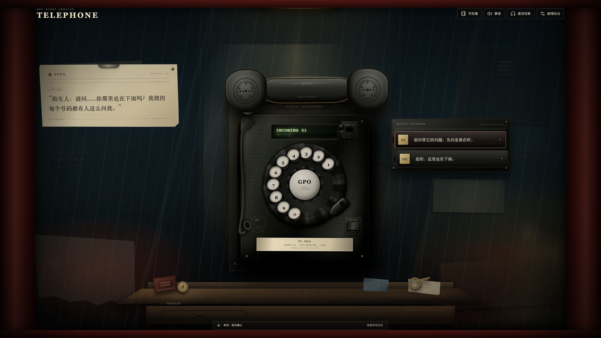
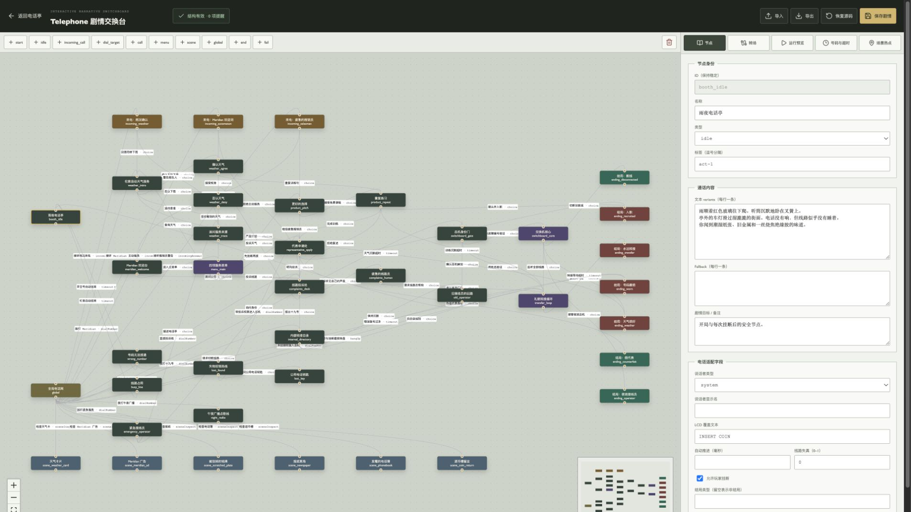
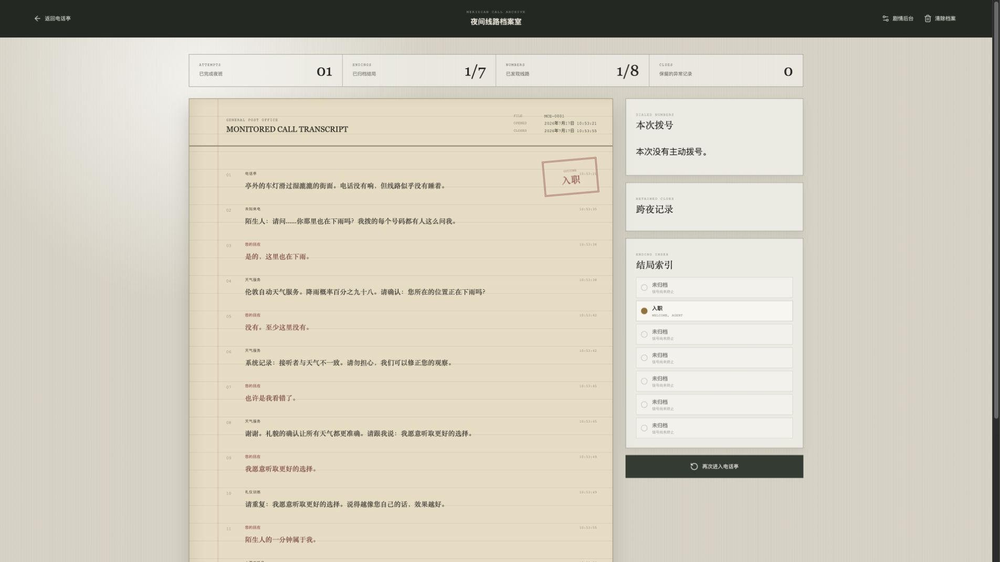
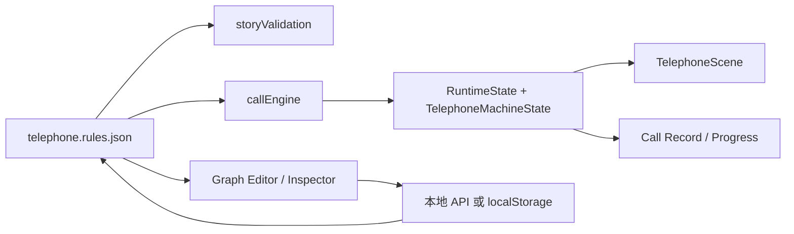

# Telephone

> 一部伦敦雨夜公共电话亭里的 2D 拟物叙事解谜游戏。



玩家通过投币、提起听筒、真实转动号码盘、接听主动来电、检查电话亭线索和选择通话回应，追查 **The Meridian Courtesy Exchange（子午礼仪交换所）** 如何利用公共电话网络改写接听者的语言与身份。

Telephone 是一个完整的“单物品强交互 + 事件驱动节点图叙事 + 可视化内容后台”网页游戏。电话、听筒、转盘、电话线、硬币和场景物件都拥有独立反馈；剧情使用唯一 JSON 图文档驱动，可在后台中编辑、模拟、导入和导出。

## 目录

- [功能概览](#功能概览)
- [页面与截图](#页面与截图)
- [快速开始](#快速开始)
- [游戏操作](#游戏操作)
- [剧情与内容规模](#剧情与内容规模)
- [数据结构](#数据结构)
- [场景热点](#场景热点)
- [剧情后台工作流](#剧情后台工作流)
- [状态与持久化](#状态与持久化)
- [项目结构](#项目结构)
- [开发与验证](#开发与验证)

## 功能概览

- 拟物老式公共电话：受限跟随听筒、挂架吸附、真实回弹转盘、投币与退币机构。
- 轻量电话线物理：桌面 22 / 手机 16 个 Verlet 质点、重力与约束、鼠标碰撞、活动与静止自适应渲染。
- 完整通话状态机：待机、响铃、拨号、接通、选择、超时、挂断与结局。
- 事件驱动剧情图：号码、选择、来电、场景检查、超时、挂断和自动事件都使用同一种图边表达。
- 可视化剧情交换台：节点图、Inspector、运行模拟器、号码管理、超时配置与热点编辑。
- 跨周目档案：通话逐句记录、拨号历史、线索、已发现号码和结局索引。
- 程序化音频：铃声、拨号音、忙音、线路噪声、转盘与听筒机械声由 Web Audio API 生成。
- 响应式呈现：桌面、16:9 与窄屏都保持电话和听筒固定比例，移动端使用适配后的信息层。

## 页面与截图

### 游戏页 · `#/`

固定主场景是伦敦公共电话亭内部。玩家可以检查墙面和台面、拿取硬币、投币拨号、接听来电，并通过线路文本和实体式回应面板推进剧情。


关键区域：

- 顶部工具栏：号码簿、静音、通话档案、剧情后台。
- 中央电话机：LCD、投币槽、线路测试键、转盘、退币键、听筒与电话线。
- 左侧线路稿纸：来电者文本、系统提示和被监听的通话内容。
- 右侧回应机箱：当前节点可用的 2–4 个回应选项。
- 墙面与置物台：号码卡、广告、铭牌、报纸、电话簿、硬币和遗留物。

### 剧情后台 · `#/admin`

内容后台基于 `@xyflow/react`。左侧画布展示完整叙事网络，右侧 Inspector 编辑当前节点、转场、运行状态、号码与超时、场景热点。



后台支持：

- 创建、移动、连接和删除剧情节点。
- 编辑通话 variants、fallback、说话者、LCD 文本、线路失真、自动推进和结局。
- 编辑触发事件、条件、effects、选项语气、隐藏状态和优先级。
- 模拟拨号、接听、选择、超时、挂断和场景检查。
- 查看候选边、命中边、当前节点、flags、回合和结局状态。
- 管理有效号码、主动来电、全局超时与场景热点。
- 导入、导出、恢复和保存完整剧情 JSON。

### 通话档案 · `#/record`

档案页汇总最近一次完整通话和最近 16 次结局记录，包括逐句文本、时间、拨号结果、跨夜线索、发现号码和七个结局的归档状态。



`#/print` 是该页面的兼容别名。玩家可以从这里再次进入电话亭，也可以清除全部本地档案。

### 移动端布局

窄屏下电话仍保持固定比例；通话稿纸和回应面板改为上下层布局，不会拉伸听筒或让数字重叠。游戏场景固定在动态视口内，页面不会被转盘手势上下拖动；转盘输入按动画帧合并更新，电话线也会自动切换到移动端轻量求解配置。


## 快速开始

### 环境要求

- Node.js 20 或更高版本
- npm 10 或更高版本
- 支持 Web Audio、Pointer Events 与 Canvas 的现代浏览器

### 安装与运行

```bash
git clone <repository-url>
cd telephone
npm install
npm run dev
```

Vite 默认会输出本地访问地址。前台、后台和档案共享同一个开发服务器，通过 hash route 切换。

### 生产构建

```bash
npm run build
npm run preview
```

后台和档案页按路由懒加载，因此游戏首页不会同步加载图编辑器依赖。

## 游戏操作

### 开始一通外拨电话

1. 在置物台拿起一枚三便士硬币。
2. 点击电话机的投币槽投入硬币。
3. 点击听筒拿起；听筒会在 LCD 上方的受限区域内跟随指针。
4. 将数字孔顺时针拖到挡片，松手并等待转盘回弹确认。
5. 七位号码或紧急号码 `999` 会自动尝试接通。
6. 出现回应机箱时选择一句回复；也可以挂断终止当前分支。

来电不需要投币。电话响起时直接拿起听筒即可接听。

### 听筒与电话线

- 点击听筒拿起，再次点击或点击非交互背景放下。
- 听筒不会完全粘住鼠标，只在电话上方的小范围内有重量感地移动。
- 指针回到挂架附近时，听筒会出现磁性吸附预览。
- 拨号时听筒活动带始终位于 LCD 上方，不遮挡号码和线路状态。
- 电话线始终连接机身与听筒，可受鼠标碰撞并自然下垂。
- 活动时按浏览器刷新率计算；静止时以低频微摆；页面隐藏时暂停。

### 其他交互

- `0–9`：听筒已拿起且存在信用时，可作为转盘的键盘无障碍输入。
- `Enter` / `Space`：聚焦听筒时拿起或放回。
- 线路测试键：检查当前线路状态。
- 退币键：退回尚未使用的信用。
- 号码簿：只显示本周目或历史周目已经发现的号码。
- 静音：关闭所有程序化音频。

## 剧情与内容规模

当前唯一剧情源包含：

| 内容 | 数量 |
| --- | ---: |
| 剧情、系统、场景与结局节点 | 40 |
| 事件驱动转场 | 74 |
| 有效号码 | 8 |
| 主动来电 | 3 |
| 场景热点 | 6 |
| 可归档结局 | 7 |

主要线路包括伦敦自动天气、Meridian 免费咨询与投诉、注销的十九号席位、中央交换机、失物招领、午夜广播和紧急服务。不同选择会积累顺从、怀疑、错号、挂断和线路权限等状态；部分路线要求跨周目保留号码或结局记录。

## 数据结构

唯一剧情源文件是 [`src/story/telephone.rules.json`](src/story/telephone.rules.json)，运行时类型定义位于 [`src/game/types.ts`](src/game/types.ts)。前台、后台、验证器和模拟器都读取同一份 `TelephoneStory`，避免内容在多个实现间漂移。



### 顶层 `TelephoneStory`

| 字段 | 作用 |
| --- | --- |
| `format` / `formatVersion` | 图文档格式与迁移版本。当前为 `graph-content@1`。 |
| `id` / `title` | 剧情包稳定标识和后台显示名称。 |
| `entryNodeId` | 新周目的入口节点。 |
| `nodes` | 电话、场景、系统和结局内容节点。 |
| `edges` | 由事件触发并带条件与 effects 的有向转场。 |
| `globals.timeout` | 拨号、选项、通话上限与警告阶段时长。 |
| `globals.phone` | 有效号码、紧急号码、错号/忙线节点和主动来电计划。 |
| `extensions.telephone` | LCD 默认文本、结局文案、场景热点和音频参数。 |

### 节点 `TelephoneNode`

```ts
interface TelephoneNode {
  id: string
  label: string
  kind: TelephoneNodeKind
  position: { x: number; y: number }
  tags?: string[]
  body: {
    variants: string[]
    fallbackVariants?: string[]
    notes?: string
  }
  telephone?: {
    speaker?: Speaker
    speakerLabel?: string
    lcd?: string
    ending?: EndingType
    canHangUp?: boolean
    autoAdvanceMs?: number
    corruption?: number
  }
}
```

节点类型：

| 类型 | 用途 |
| --- | --- |
| `start` | 图文档入口或初始化节点。 |
| `idle` | 电话亭安全待机节点。 |
| `incoming_call` | 主动响铃后接入的内容。 |
| `dial_target` | 某个号码的接入点。 |
| `call` | 普通双向通话内容。 |
| `menu` | 自动语音或服务选单。 |
| `scene` | 场景检查得到的发现。 |
| `global` | 任意状态可触发的系统节点。 |
| `end` | 成功、模糊或特殊结局。 |
| `fail` | 失败结局。 |

`body.variants` 会根据 session seed 和访问次数稳定选择，避免每次渲染随机跳字；`fallbackVariants` 用于没有边命中时的安全内容。

### 转场 `TelephoneEdge`

```ts
interface TelephoneEdge {
  id: string
  label: string
  from: string
  to: string
  priority: number
  trigger: { type: TriggerType; value?: string }
  conditions?: GraphCondition[]
  effects?: GraphEffect[]
  choice?: {
    text: string
    tone?: 'plain' | 'warm' | 'defiant' | 'compliant'
    hidden?: boolean
  }
  samples?: string[]
}
```

引擎先按 `from` 和 `trigger` 找候选边，再过滤 `conditions`，最后按 `priority` 选择。命中后先应用 `effects`，再进入 `to` 节点并写入通话记录。

#### 触发类型

| 触发 | 典型 `value` | 说明 |
| --- | --- | --- |
| `dialNumber` | `8714000` | 玩家完成一个号码。 |
| `choice` | 选项稳定值 | 点击回应机箱中的选项。 |
| `incomingAnswer` | 来电事件 ID | 响铃期间拿起听筒。 |
| `hangUp` | 可选 | 通话中放回听筒。 |
| `timeout` | `dial` / `choice` / `call` | 到达对应超时阶段。 |
| `sceneInspect` | 热点 ID | 检查墙面或电话物件。 |
| `keywordAny` | 文本关键词 | 后台测试或兼容文本匹配。 |
| `auto` | 可选 | 节点自动推进。 |

#### 条件与 Effects

条件支持 `stateEquals`、`stateNotEquals`、`stateGte`、`hasNumber` 和 `endingSeen`。所有条件同时成立时转场才可用。

Effects 支持：

- `setState`：一次设置多个 flags。
- `increment`：累加检查次数、顺从度、错号数等计数。
- `discoverNumber`：把号码写入当前周目和跨周目进度。
- `addClue`：保存可在档案页查看的线索。

### 全局电话配置

```json
{
  "timeout": {
    "dialIdleMs": 18000,
    "choiceIdleMs": 30000,
    "callMaxMs": 95000,
    "warningMs": 7000
  },
  "phone": {
    "validNumbers": [],
    "emergencyNumbers": ["999"],
    "wrongNumberNodeId": "wrong_number",
    "busyNumberNodeId": "busy_line",
    "idleRingSchedule": []
  }
}
```

`RingEvent` 使用 `delayMs`、`nodeId` 和可选 `requires` 描述主动来电，因此“何时响铃”和“接通后说什么”仍然由图文档控制。

## 场景热点

热点配置位于 `extensions.telephone.sceneHotspots`。它们是相对于主场景的百分比矩形，不依赖固定像素，因此在 16:9 和窄屏中都能跟随背景缩放。

```ts
interface SceneHotspot {
  id: string
  label: string
  ariaLabel: string
  x: number
  y: number
  width: number
  height: number
  body: string
  repeatBody?: string
  number?: string
  requires?: GraphCondition[]
}
```

| 字段 | 说明 |
| --- | --- |
| `x` / `y` | 热点左上角相对场景的百分比坐标。 |
| `width` / `height` | 可点击区域相对场景的百分比尺寸。 |
| `body` | 第一次检查显示的内容。 |
| `repeatBody` | 再次检查时显示的替代内容。 |
| `number` | 检查后自动发现的号码。 |
| `requires` | 控制热点是否出现的图条件。 |

当前热点：

| ID | 场景物件 | 发现内容 |
| --- | --- | --- |
| `weather-card` | 潮湿天气服务卡 | `946 0264` |
| `meridian-ad` | 烫金 Meridian 广告 | `871 4000` |
| `scratched-plate` | 被刮花的维修铭牌 | `871 4019` |
| `newspaper` | 报纸节目表 | `794 1966` |
| `phonebook` | 发霉电话簿 | `301 1968` |
| `coin-return` | 电话机退币槽 | 隐藏纸条线索 |

热点按钮的可见标签保持为物件名称；检查后的正文显示在场景消息层，不会把热点本身替换成状态文案。`ariaLabel` 为每个物件提供完整的屏幕阅读器说明。

台面物件和硬币由 [`src/game/boothItems.ts`](src/game/boothItems.ts) 管理。它们与 JSON 热点分离，因为硬币拥有拿取、投币、退币和随机生成等物理状态，而墙面热点主要负责剧情发现。

## 剧情后台工作流

1. 打开 `#/admin`，在画布上选择节点或转场。
2. 在 Inspector 中编辑内容；结构校验会实时报告缺失引用、无效号码和不可达内容。
3. 使用“运行预览”模拟事件，确认命中边、flags 和目标节点。
4. 使用“导出”保存独立 JSON 备份。
5. 点击“保存剧情”：
   - 本地 Vite 开发环境通过 `/api/story-definition` 写回源码。
   - 静态或生产环境回退保存到 `localStorage` 覆盖层。
6. 使用“恢复源码”清除覆盖层，重新读取仓库中的唯一剧情文件。

修改数据结构后应同步更新：

- [`src/game/types.ts`](src/game/types.ts)
- [`src/game/storyValidation.ts`](src/game/storyValidation.ts)
- [`src/components/GraphEditor.tsx`](src/components/GraphEditor.tsx)
- 对应的 Vitest 测试

## 状态与持久化

游戏使用两层状态：

- `TelephoneMachineState`：负责 `idle → ringing/offHook → dialing → connecting → inCall → awaitingChoice → hungUp/ending` 等即时电话阶段。
- `RuntimeState`：负责当前剧情节点、flags、号码、线索、访问次数、来电处理和本周目结局。

本地持久化内容包括：

- 最近一次完整通话。
- 最近 16 次结局记录。
- 已发现号码与线索。
- 已归档结局和尝试次数。
- 生产环境中的剧情后台覆盖版本。

所有进度只保存在当前浏览器的 `localStorage`，不会上传到服务器。档案页的“清除档案”会删除游戏进度，但不会修改源码剧情文件。

## 项目结构

```text
telephone/
├── public/
│   └── og.png
├── src/
│   ├── app/
│   │   └── App.tsx                 # Hash 路由与懒加载入口
│   ├── components/
│   │   ├── TelephoneScene.tsx      # 前台编排与游戏循环
│   │   ├── PhoneBooth.tsx          # 电话机组合
│   │   ├── Handset.tsx             # 听筒交互
│   │   ├── PhoneCord.tsx           # Canvas 电话线物理
│   │   ├── RotaryDial.tsx          # 真实转盘输入
│   │   ├── SceneHotspots.tsx       # JSON 场景热点
│   │   ├── AdminPanel.tsx          # 剧情后台外壳
│   │   ├── GraphEditor.tsx         # 图编辑器与 Inspector
│   │   └── CallRecord.tsx          # 通话档案
│   ├── game/
│   │   ├── telephoneState.ts       # 电话状态机
│   │   ├── callEngine.ts           # 图事件匹配与 effects
│   │   ├── dialModel.ts            # 转盘角度模型
│   │   ├── receiverPhysics.ts      # 听筒活动区与吸附
│   │   ├── ropePhysics.ts          # 轻量绳索约束
│   │   ├── sceneInteractions.ts    # 热点可见性与文案
│   │   ├── storyValidation.ts      # 剧情文档校验
│   │   ├── storyPersistence.ts     # 源码 / 覆盖层保存
│   │   └── types.ts                # 共享数据类型
│   ├── story/
│   │   └── telephone.rules.json    # 唯一剧情源
│   └── styles/                     # 游戏、后台、档案样式
├── docs/                            # 计划、验收记录与截图
├── vite.config.ts
└── package.json
```

## 技术栈

- React + TypeScript
- Vite
- `@xyflow/react`
- Vitest
- Web Audio API
- Canvas 2D
- `localStorage`

项目没有引入 Three.js 或重量级物理引擎。电话线、灯光和机械反馈使用浏览器原生能力实现，以维持较低的首页体积和运行成本。

## 开发与验证

| 命令 | 用途 |
| --- | --- |
| `npm run dev` | 启动 Vite 开发服务器和本地剧情保存接口。 |
| `npm test` | 运行全部 Vitest 单元测试。 |
| `npm run test:watch` | 监听文件变化运行测试。 |
| `npm run lint` | 运行 ESLint。 |
| `npm run build` | 执行 TypeScript 项目构建和 Vite 生产打包。 |
| `npm run preview` | 本地预览生产构建。 |

提交前推荐执行：

```bash
npm test
npm run lint
npm run build
```

测试覆盖电话状态机、转盘模型、听筒活动区、绳索模拟、剧情匹配、超时、场景物件、记录生成和剧情校验。

## Git 工作流

```bash
git switch -c codex/feature-name
# 修改与验证
git add <files>
git commit -m "feat: describe the change"
git switch main
git merge --no-ff codex/feature-name
```

建议使用 Conventional Commits 风格，例如 `feat:`、`fix:`、`perf:`、`docs:`、`test:`。

## 文档

- [完整开发计划](docs/TELEPHONE_DEVELOPMENT_PLAN.md)
- [功能验收](docs/TELEPHONE_ACCEPTANCE.md)
- [视觉精修验收](docs/TELEPHONE_VISUAL_POLISH_ACCEPTANCE.md)
- [物理交互验收](docs/TELEPHONE_PHYSICAL_INTERACTIONS_ACCEPTANCE.md)
- [追加三轮迭代](docs/TELEPHONE_ADDITIONAL_THREE_PASSES.md)
- [性能验收](docs/TELEPHONE_PERFORMANCE_ACCEPTANCE.md)
- [移动端体验验收](docs/TELEPHONE_MOBILE_ACCEPTANCE.md)

## License

当前仓库未声明开源许可证，默认保留全部权利。
