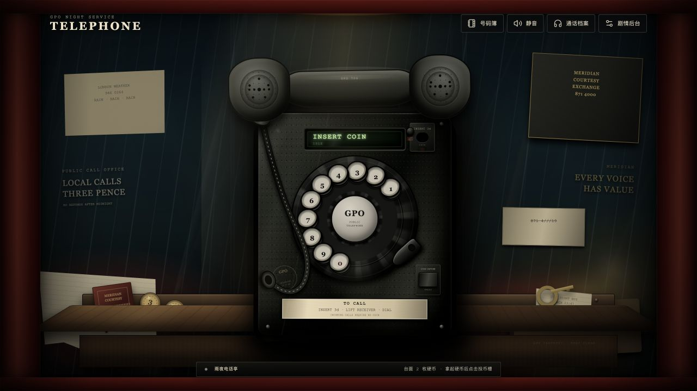
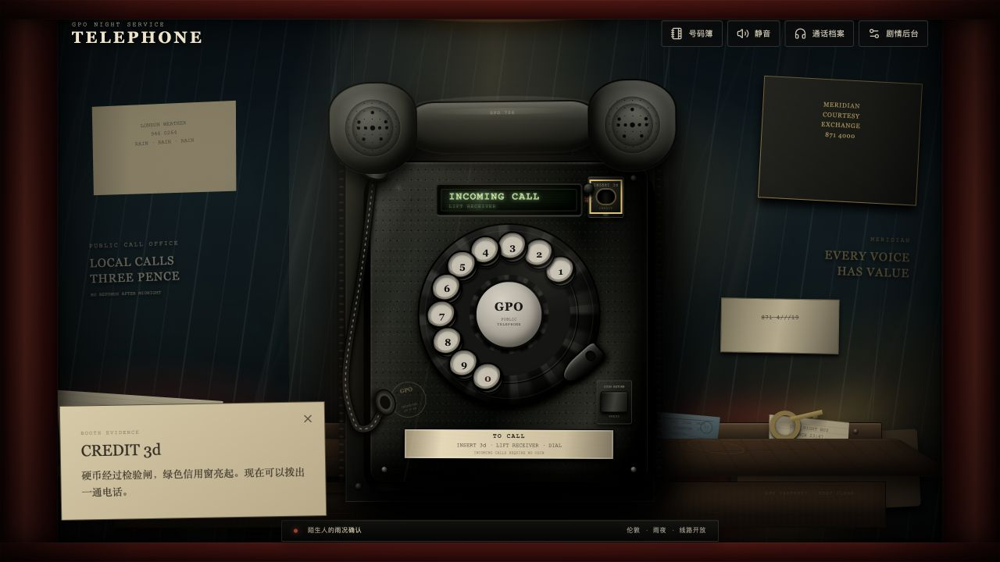
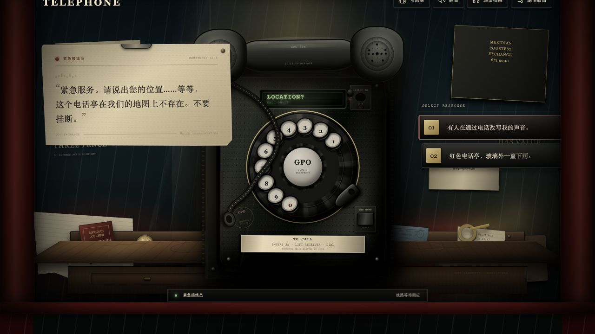
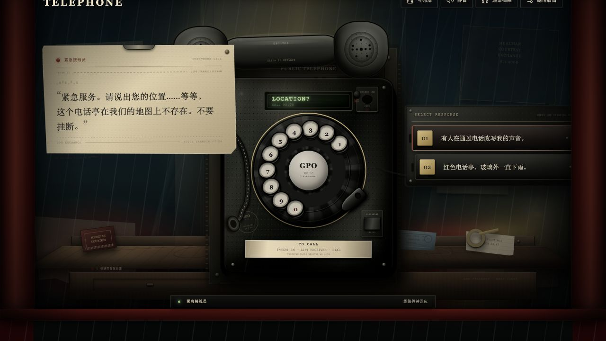
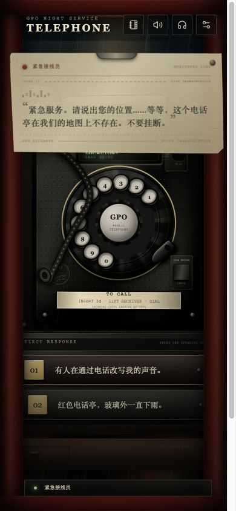
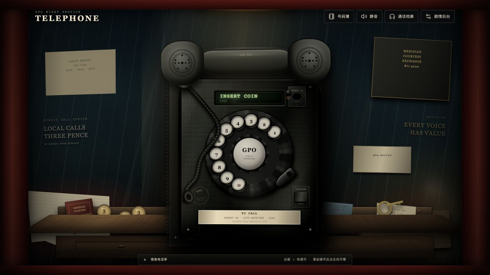

# Telephone 追加三轮美术与交互迭代

本文件记录在电话物理交互定稿之后追加的三轮独立迭代。三轮均遵循同一流程：先设定新的目标，再修改代码，通过本地浏览器实际操作和截图复核；发现问题时继续修正，直到该轮目标成立后才进入下一轮。

## 追加迭代基线

基线已经具备固定比例电话、受限悬浮听筒、Verlet 电话线、置物台、投币流程和基本拟物材质。本次追加迭代不重复这些成果，重点处理空间纵深、机械状态反馈和通话信息层。



## 第一轮：空间纵深与台面叙事

### 目标

- 强化电话与墙面的安装关系，避免电话像悬浮在背景前。
- 增加台面厚度、磨损、抽屉结构和长期使用痕迹。
- 增加一件不抢电话主体、但可以拿起查看的新遗留物。

### 完成内容

- 电话背后增加金属安装背板、左右固定轨、四枚安装螺栓和独立墙面阴影。
- 台面增加杯底水环、细划痕、前柜抽屉和金属把手。
- 新增可拾取的“交换台回执”，带有独立纸张材质、编号和剧情描述。
- 第一张复核截图暴露了负层级触发的黑色合成块；将背板纳入隔离的正层级后重新截图，主体恢复完整。

### 复核结论

电话主体、背板、墙面和台面形成清晰的前后关系；台面共有四件可拾取物，硬币仍处于前景交互层。


## 第二轮：机械状态反馈与电话线触感

### 目标

- 让投币、退币和线路测试的内部机械动作可见，而不只是改变文字状态。
- 让指针接触电话线时出现明确但克制的材质反馈。
- 验证新增动画不会污染稳定画面。

### 完成内容

- 投币时增加硬币进入检验闸、信用窗闪亮和内部下落动画。
- 退币时增加退币门动作和硬币滑出轨迹。
- 线路测试键增加按压、扩散环和两段脉冲反馈。
- 电话线只在指针真正靠近质点时进入碰撞状态，并增加短暂亮度与接触阴影响应。
- 动画状态在规定时间后自动清除，不改变拨号、来电或信用规则。

### 实机验证

- 投币动画期间装配体状态为 `mechanical-coin-in`，信用窗变为 `has-credit`，台面硬币减少一枚。
- 线路测试状态为 `mechanical-line-test`。
- 退币状态为 `mechanical-coin-out`，信用清空，台面硬币从 1 枚恢复为 2 枚。
- 指针靠近电话线后 `data-collision` 从 `idle` 变为 `active`。
- 活动动画截图会触发浏览器合成贴片，因此验收图使用机构停止后的稳定帧；最终游戏画面无贴片。



## 第三轮：通话纸带与实体回应键

### 目标

- 让对方文字、线路状态和玩家回应看起来属于交换台设备，而非浮在网页上的现代气泡。
- 通话时压低无关背景信息，保持电话、转写纸带和回应键的阅读层级。
- 同时完成桌面和窄屏通话界面验收。

### 改造前参考

改造前已经使用纸张和矩形按键，但回应组仍缺少完整机箱，纸带也没有连续进纸与线路路由信息。



### 完成内容

- 转写纸带加入连续纸孔、交换线路编号、`LIVE TRANSCRIPTION` 路由和更明确的纸张压痕。
- 回应选项整合进带有铆钉、接线、分隔线和状态灯的实体 speaking-key 机箱。
- 通话时降低墙面文案、热点、台面和街灯的视觉权重，保持电话主体可见。
- 桌面回应机箱限制在视口右缘以内；移动端恢复左右 18px 的全宽机箱布局。
- 移除会影响包含 Canvas 电话线层的合成滤镜，消除桌面和移动端黑色贴片。
- 修复移动端火柴盒点击层覆盖第一枚硬币的问题，硬币提升到可拾取前景层。

### 桌面复核

- `1280 × 720` 视口中，纸带右缘约 `500px`，回应机箱右缘约 `1229px`，均位于视口内。
- 电话装配体比例约 `0.775`，回应选项 2 项，页面无横向溢出。



### 窄屏复核

- `390 × 844` 视口中，纸带范围约 `17–371px`，回应机箱范围 `18–357px`。
- 两组回应键完整显示，电话比例约 `0.775`，无横向溢出。
- 移动端实际完成“拾取硬币—投币—提筒—拨打 999—进入回应节点”的完整流程。



## 最终静态画面

桌面最终待机画面包含安装背板、自然 S 形电话线、台面抽屉、三枚本夜硬币和四件遗留物。



## 最终验证

```text
npm test      9 个测试文件，34 项测试通过
npm run lint  通过
npm run build 通过；Vite 报告主包约 500 kB 的代码分割建议，不影响构建产物
```

| 验收项 | 结果 |
| --- | --- |
| 三轮均先设定独立目标 | 通过 |
| 每轮完成后浏览器截图复核 | 通过 |
| 桌面通话层无合成黑块 | 通过 |
| 窄屏通话层无合成黑块 | 通过 |
| 桌面 / 窄屏横向溢出 | 0 |
| 电话固定比例 | 约 `0.775` |
| 转盘数字重叠 | 0 组 |
| 移动端硬币拾取层级 | 通过 |
| 机械投币 / 退币 / 线路测试 | 通过 |
| 电话线指针碰撞 | 通过 |
