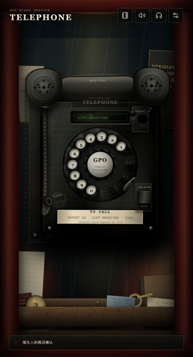
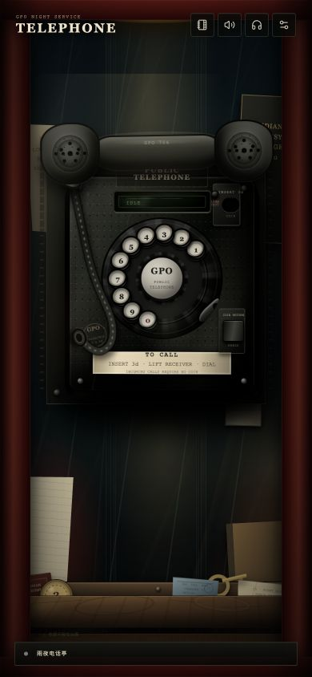
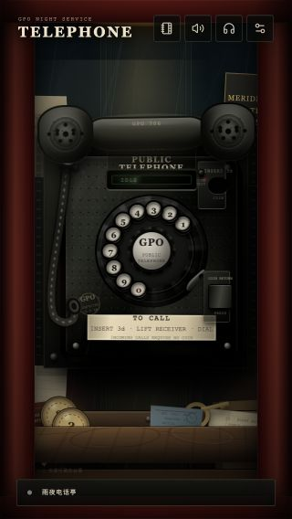

# Telephone 移动端体验验收

## 本轮目标

- 锁定游戏动态视口，阻止拨号和场景交互把整页上下拖动。
- 缩小电话机和工具 UI，在 320–390 px 宽度内保留稳定留白与完整比例。
- 让置物台和 1–3 枚硬币在手机首屏内保持清晰、可点击。
- 降低转盘、听筒、环境灯光和电话线在触摸拨号期间的重复计算。
- 分阶段截图复核待机、极窄屏和通话回应三种关键状态。

## 实现摘要

### 视口与触摸

- 手机端将 `html`、`body`、`#root` 和游戏场景锁定到动态视口，禁用根页面溢出和滚动链。
- 游戏场景使用固定定位与裁切；转盘数字孔独立使用 `touch-action: none`，避免拨号手势被浏览器解释成页面拖动。
- 通话稿纸、回复列表、号码簿和发现卡仍保留自己的纵向滚动能力。

### 构图与可读性

- 电话机宽度由视口宽、高共同约束，在 390×720 下为约 304 px，在 320×568 下为约 250 px。
- 置物台固定在屏幕底部，硬币增大到 42 px 基准尺寸，并强化黄铜高光、边缘与投影。
- 工具栏、状态条、通话稿纸和回复按键使用独立的手机端间距与字体比例。
- 回复面板左右各保留 42 px，完整落在红色电话亭框架内。

### 拨号性能

- 转盘在手势开始时只读取一次几何尺寸和圆心，不再为每次 `pointermove` 触发布局读取。
- 角度更新、React 状态和棘轮音效合并到 `requestAnimationFrame`；浏览器验收手势中 12 次移动事件合并为 6 帧绘制。
- 手机电话线从 22 个质点 / 8 次约束迭代降为 16 个质点 / 5 次迭代，Canvas 像素比上限降为 1.25。
- 触摸拨号不再同步驱动听筒 hover、电话线鼠标碰撞和环境灯光跟随。

## 量化验收

| 项目 | 优化前 | 优化后 |
| --- | ---: | ---: |
| 390×720 电话机宽度 | 约 359 px | 约 304 px |
| 390×720 场景滚动位置（拖动后） | 166 px | 0 px |
| 390×720 置物台 | 底部越界 | 完整位于 556–716 px |
| 320×568 电话机宽度 | 几乎占满 | 约 250 px |
| 拨号移动事件 / 绘制帧 | 每次移动均可能更新 | 12 / 6（帧合并） |

## 截图迭代

### 第一轮：缩小电话并恢复置物台



### 第二轮：检查高屏比例与底部留白



### 第三轮：极窄屏与最终待机构图




### 最终通话状态


通话状态实测：场景 `scrollTop = 0`；稿纸范围为 `x=12–378`；回复面板范围为 `x=42–348`，未与电话亭左右框架相交。

## 自动化验证

交付前运行：

```bash
npm test
npm run lint
npm run build
```

单元测试覆盖电话状态机、转盘数学、听筒活动区、绳索约束、剧情引擎、场景交互、记录与持久化；浏览器验收覆盖 390×720、390×844 和 320×568 三种手机视口。
