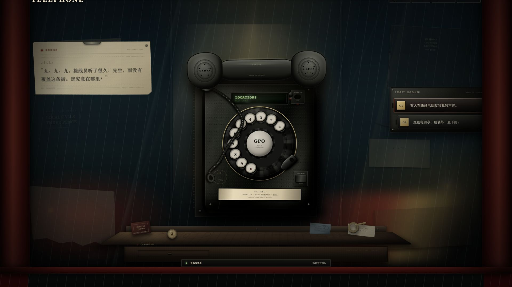
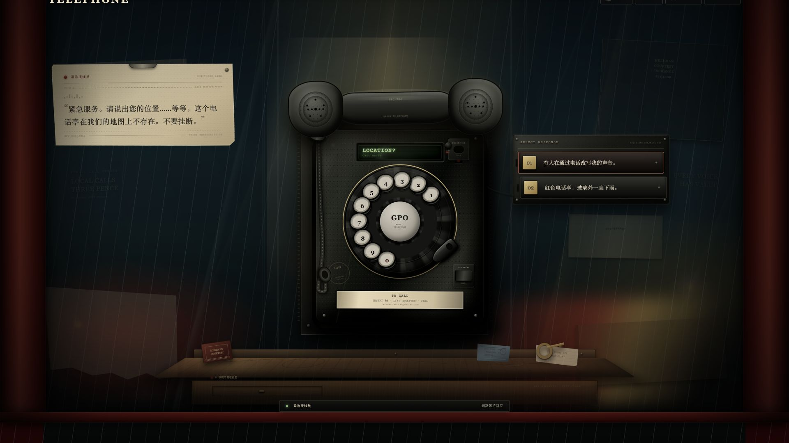
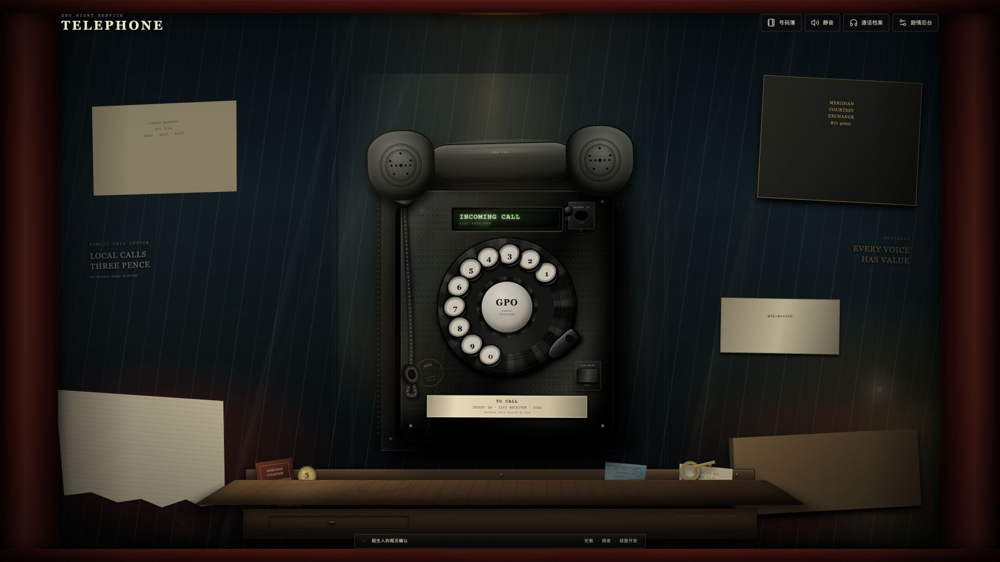
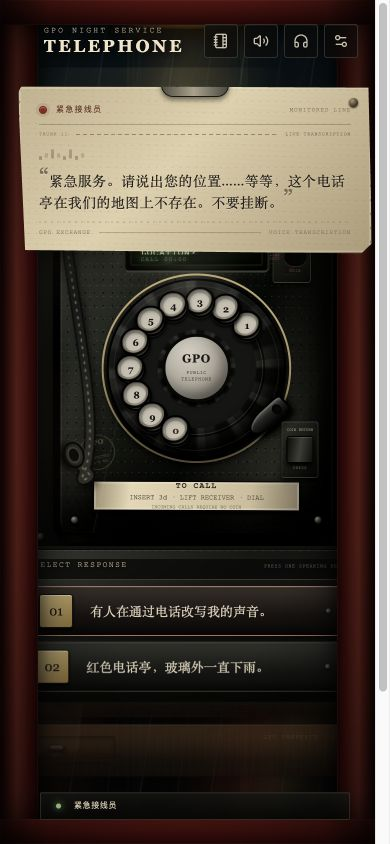

# Telephone 16:9 布局与性能优化验收

## 本轮目标

- 修正宽屏 16:9 环境中回应机箱过度贴近视口右侧的问题。
- 降低指针光效、全场景滤镜和电话线 Canvas 的持续工作量。
- 保持电话线自然动态：鼠标静止后不冻结，同时避免无意义地持续满帧渲染。
- 保证后台、档案页、1280×720 和 390×844 布局不回归。

## 16:9 回应位置

原布局使用 `right: 4%` 相对视口定位。在 `1920 × 1080` 下，电话右缘为 `1227.5px`，回应机箱左缘为 `1463.2px`，两者相距约 `235.7px`。



新布局改为围绕电话中心定位：`left: calc(50% + clamp(200px, 15vw, 290px))`。同一视口下，回应机箱左缘变为 `1248px`，与电话右缘只保留 `20.5px` 的机械接线间距；机箱右缘为 `1628px`，仍完整位于视口内。



在 `1280 × 720` 下，回应机箱范围为 `840–1211px`，与电话边缘轻微叠接 `32.6px`，形成紧凑的设备组合且不产生横向溢出。`761–1100px` 之间使用独立的右侧安全区规则，移动端继续使用左右 `18px` 的全宽布局。

## 电话线自适应调度

旧实现会在最后一次指针输入后的 `460ms` 直接停止 `requestAnimationFrame`，因此鼠标静止后线缆完全冻结。

新实现分为三种状态：

- `active`：最近 `950ms` 内存在有效交互，按浏览器刷新率更新碰撞和听筒端点。
- `idle`：可见页面中每 `120ms` 更新一次，以约 8fps 维持重力约束和极轻微环境摆动。
- `paused`：标签页隐藏时取消动画帧和定时器；回到页面后自动恢复。

实机静止采样结果：

| 指标 | 第一次采样 | 760ms 后 |
| --- | ---: | ---: |
| 模式 | `idle` | `idle` |
| 渲染计数 | 111 | 117 |
| 中点坐标 | `107.414, 400.077` | `114.003, 398.591` |

760ms 内产生 6 次低频更新，且绳索中点实际发生变化，证明线缆没有冻结。指针靠近线缆时会立即从待机定时器提升至 `active`，不再有最长 120ms 的首次碰撞延迟。



## 运行性能改动

- 指针环境光由每个 `pointermove` 直接读写布局，改为 `requestAnimationFrame` 合并：每帧最多读取一次场景边界、写入一次光标变量。
- 电话线指针事件只保存坐标；边界换算和最近质点计算统一进入绘制帧。
- 听筒挂起时，远离电话区域的指针移动不再唤醒电话线高帧率模式。
- 一帧只构建一次 `Path2D`，阴影、橡胶主体和高光共用路径。
- 橡胶渐变只在尺寸变化时创建，不再每帧重新创建。
- 移除 Canvas、电话装配体、远景散景和远雨层上的大面积 CSS `filter` 合成层；线缆阴影继续由 Canvas 自身绘制。
- 通话时台面压暗改用透明度，避免对整块宽台面执行亮度和饱和度滤镜。

## 首屏代码分割

剧情后台包含 `@xyflow/react`，此前与游戏首页同步进入主包。后台和档案页现已通过 `React.lazy` 按 hash 路由加载，对应样式也跟随页面分包。

| 生产产物 | 优化前 | 优化后 |
| --- | ---: | ---: |
| 首页 JS | `501.10 kB` | `292.33 kB` |
| 首页 JS gzip | `157.62 kB` | `92.68 kB` |
| 首页 CSS | `99.67 kB` | `70.82 kB` |
| 首页 CSS gzip | `23.52 kB` | `18.14 kB` |

首页 JavaScript 体积下降约 41.7%。后台成为独立的 `204.88 kB` 异步块，档案页成为 `5.97 kB` 异步块。浏览器实测 `#/admin` 和 `#/record` 均能完成懒加载并显示正确页面。

## 跨尺寸验证

`390 × 844` 下：

- 转写纸带范围约 `17–371px`。
- 回应机箱范围 `18–357px`。
- 电话固定比例约 `0.775`。
- 两项回应完整显示，页面横向滚动宽度等于视口宽度。



## 自动化验证

```text
npm test      9 个测试文件，35 项测试通过
npm run lint  通过
npm run build 通过，无超大主包警告
```

新增测试覆盖电话线从 `active` 进入 `idle`、可见页面保持低频运行，以及隐藏页面进入 `paused`。
