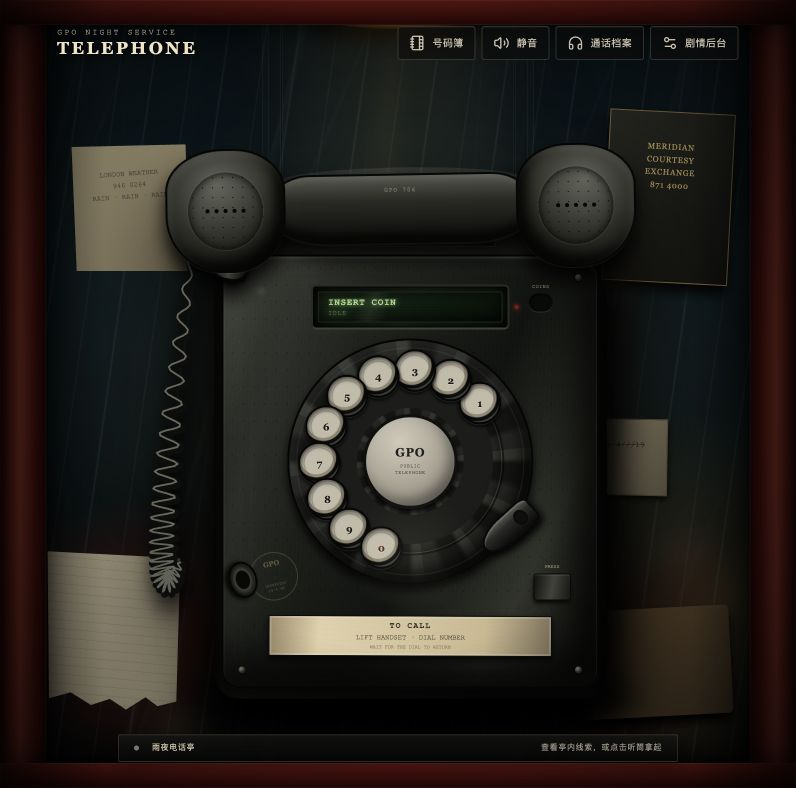
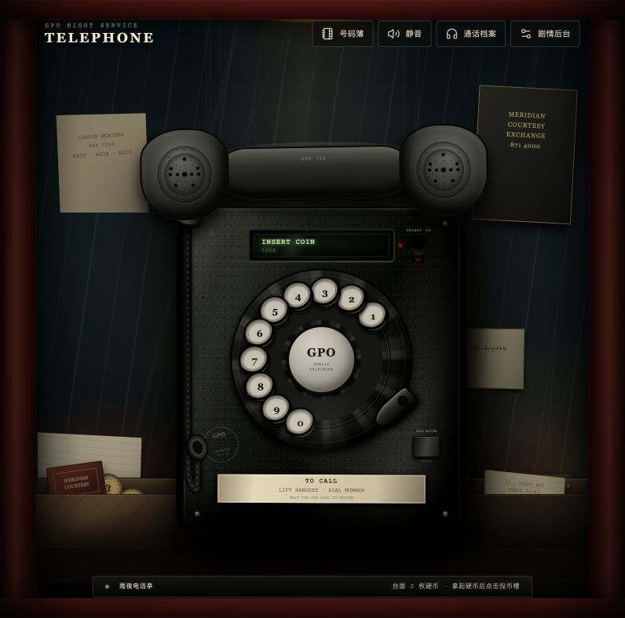
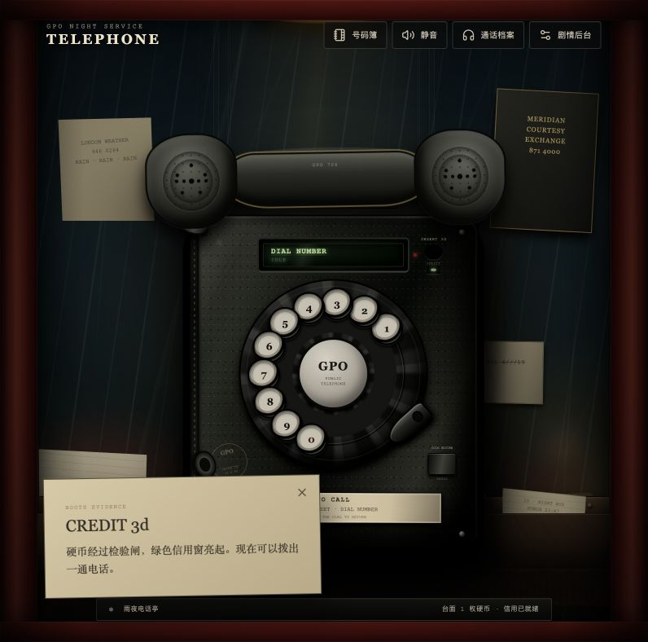
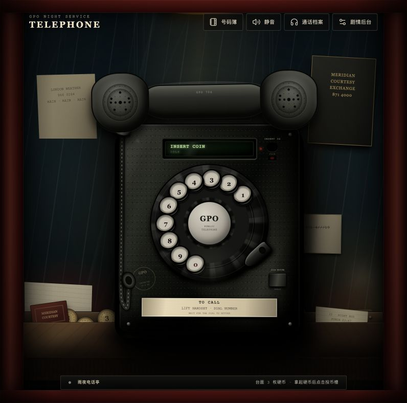
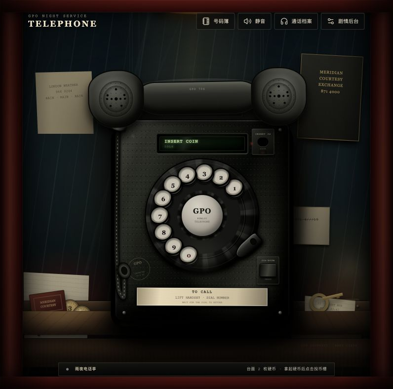
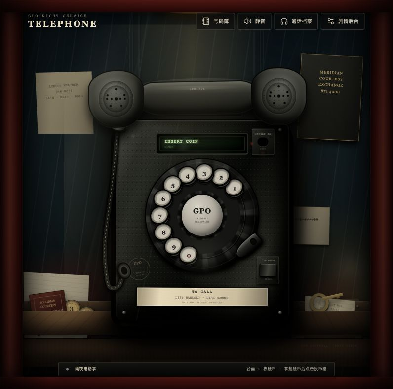
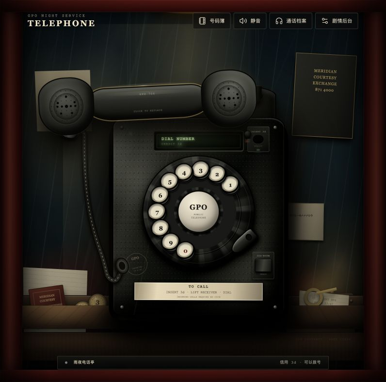
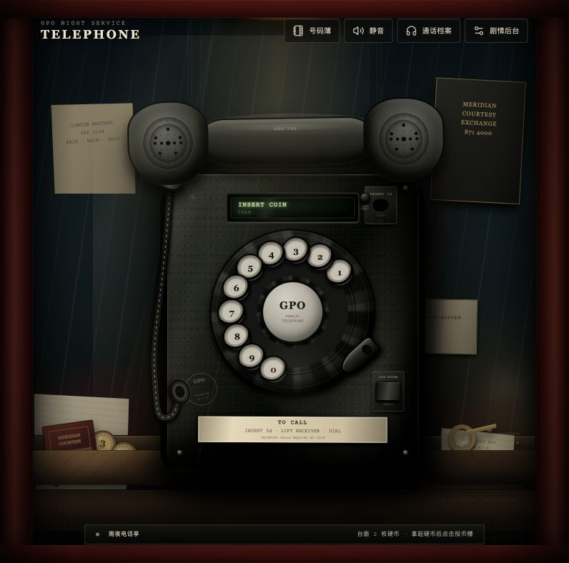
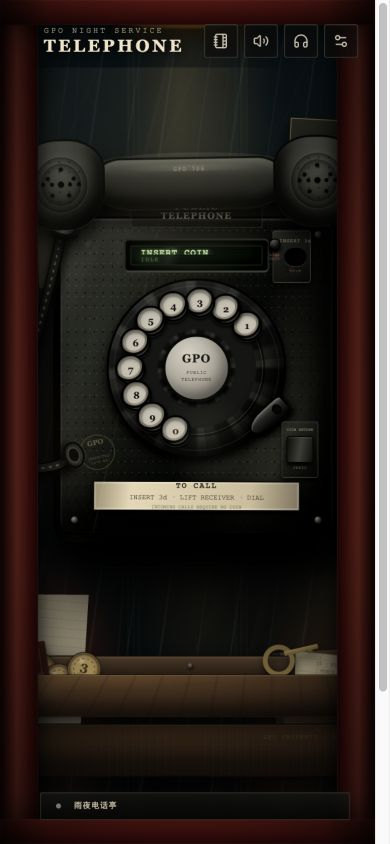

# Telephone 电话物理交互与美术定稿验收

## 本轮目标

本轮将电话从“可操作的网页图形”推进为有重量、距离感和明确机械规则的拟物装置，并完成以下内容：

- 听筒采用点击拿起 / 再次点击放下，跟随被限制在电话上方区域，并保留挂架附近的磁性吸附。
- 电话线始终连接机身与听筒，自然垂落，并能响应听筒运动与指针碰撞。
- 电话、听筒和拨号盘跨尺寸保持固定比例；前台内容不可选中，转盘数字不再重叠。
- 投币槽、退币键、线路测试键均可交互；每次夜班随机生成 1–3 枚三便士硬币。
- 外拨必须投币，来电可免费接听；未使用信用可以退回台面。
- 电话下方增加木质置物台、接触阴影、车票、火柴盒、黄铜钥匙和遗落硬币。
- 点击场景线索后，热点标题保持原文，不再被“已查看”状态替换。
- 完成一次核心重制和三轮额外美术 / 交互迭代，并以浏览器实机截图逐阶段复核。

## 实现摘要

### 听筒与电话线

听筒的指针位移分别以 `0.34` 和 `0.26` 的跟随系数映射，并限制在电话装配体宽度 `±24%`、高度 `-10%` 至 `+9.5%` 的区域内。它仍保留出架距离、回架吸附距离、旋转惯性和固定比例外形。

电话线采用 22 个质点的 Verlet 积分与长度约束：两端分别钉在机身出线口和听筒接头，中间质点承受重力、阻尼和 8 次距离修正。指针进入绳索区域时会形成圆形碰撞体，将相邻质点推开。渲染采用 Canvas 的多层圆角曲线、橡胶渐变、高光和接触阴影；静止后停止动画帧，避免持续占用渲染资源。

技术取舍参考了 `requestAnimationFrame` 的浏览器帧同步机制、Thomas Jakobsen 的 Verlet 约束方法，以及 Matter.js 的约束模型；本项目体量只需要一条短绳，因此保留了自有轻量实现，没有引入完整物理引擎。

### 投币与台面物件

夜班硬币数量由当前 `sessionSeed` 稳定映射为 1–3 枚。玩家必须先拿起硬币，再点击投币槽建立一份 `3d` 信用。拨号接通时信用被消耗；按退币键会生成一枚回到台面的硬币。主动来电分支直接进入 `incomingAnswer`，不检查也不改变信用。

台面物件均为真实按钮语义：末班车票、Meridian 火柴盒和 19 号黄铜钥匙可以拿起、查看并放回；电话机上的线路测试键会根据响铃、无信用或已有信用给出不同机械反馈。

## 分阶段截图

### 改造前基线



### 主体与固定比例实现



### 电话线物理与投币流程



### 核心场景定稿



## 三轮额外迭代

### 第一轮：结构可读性

目标：让台面、前挡板、遗落物、电话线和投退币机构形成清楚的前后层次，并让所有看似可按的部件都真正可操作。

复核：台面已经形成水平承重面与前挡板；硬币和三个遗留物有各自轮廓；投币、退币和线路测试都具备按钮语义与反馈。下一轮转向材质、接触关系和局部光线。



### 第二轮：材质与接触

目标：增加方向性顶光、机身压暗边缘、挂架与线缆接头、台面反光和更可信的接触阴影，使电话从背景中凸出，同时避免矢量感。

复核：机身的颗粒漆、黑胶木听筒、纸张纤维、黄铜氧化和木质台面已经建立不同粗糙度；电话线在机身左侧形成独立垂线和落影。下一轮收紧流程提示、手持范围和微交互反馈。



### 第三轮：流程与微交互

目标：收紧听筒的上方浮动范围，明确“拿币—投币—提筒—拨号”和“来电免投币”，补齐信用窗、退币回落、线路测试及最终跨尺寸检查。

复核：实测听筒位移为 `x=-95px / y=14px`，没有黏住指针；电话线两端仍连接；投入硬币后信用窗点亮；拨打 `999` 后信用被消耗并进入接线员回应节点。



## 最终浏览器验收

| 验收项 | 结果 |
| --- | --- |
| 桌面视口 | `796 × 788`，无横向溢出 |
| 窄屏视口 | `390 × 844`，无横向溢出 |
| 电话装配体比例 | 两档视口均为约 `0.775` |
| 听筒比例 | 两档视口均为约 `2.959` |
| 转盘数字碰撞 | 10 个数字两档视口均为 `0` 组重叠 |
| 文本选择 | 前台场景计算样式为 `user-select: none` |
| 热点标题 | 点击天气服务卡前后均为“天气服务卡” |
| 外拨投币 | 投币后拨打 `999`，信用归零并进入接线员节点 |
| 退币 | 信用归零，台面硬币数量恢复，出现机械退币反馈 |
| 来电免投币 | 零信用时接听来电，进入回应节点且信用仍为空 |
| 电话线 | Canvas 标记为 `phone → handset`，抬起时端点持续固定 |





## 自动化验证

```text
npm test      9 个测试文件，34 项测试通过
npm run lint  通过
npm run build 通过
```

新增测试覆盖夜班硬币数量、退币生成、信用拨号守卫、听筒受限范围、绳索端点固定、重力下垂、长度约束和指针碰撞。
