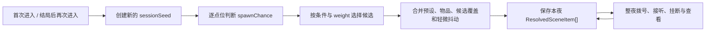

# Telephone 可复玩夜班场景改造计划

## 目标

Telephone 的墙面线索不再是每周目固定出现的一组按钮，而是一份在“新夜班开始”时生成的场景快照。每个空间点位可以为空，也可以从带权候选池中出现不同物品；物品拥有可配置的拟物外观、查看文案、剧情效果和电话簿引用。

这里的“新夜班”有严格含义：

- 首次进入电话亭时生成一次。
- 达成任一结局后，点击“再次进入”时生成下一次。
- 同一夜班内拨号、接听、挂断、超时、查看物品、窗口缩放和 React 重渲染都不得刷新。

## 数据拆分

### 1. 电话簿 `globals.phone.directory`

电话簿只描述线路本身，不包含它会出现在哪张广告上。

```ts
interface PhoneDirectoryEntry {
  id: string
  number: string
  label: string
  description: string
  initiallyKnown?: boolean
  category?: 'public' | 'meridian' | 'internal' | 'emergency' | 'strange'
}
```

场景物品通过稳定 `id` 引用电话。这样多个点位、多个外观完全不同的小广告可以揭示同一个号码；号码发生修改时也无需逐个改热点。

### 2. 空间点位 `extensions.telephone.scene.slots`

点位只负责“在哪里、是否出现、出现哪一个候选”。

```ts
interface SceneSlot {
  id: string
  label: string
  bounds: { x: number; y: number; width: number; height: number }
  mobileBounds?: { x: number; y: number; width: number; height: number }
  spawnChance: number
  requires?: GraphCondition[]
  candidates: Array<{
    propId: string
    weight: number
    requires?: GraphCondition[]
    appearanceOverrides?: Partial<SceneAppearance>
  }>
  jitter?: { x?: number; y?: number; rotation?: number; scale?: number }
}
```

`spawnChance` 决定点位整夜为空的概率；点位生成后，再由 `weight` 在符合条件的候选中选择一种。`bounds` 和 `mobileBounds` 让横屏、竖屏拥有独立但仍数据驱动的位置。

### 3. 可复用物品 `extensions.telephone.scene.props`

物品负责“它是什么、长什么样、查看时发生什么”。

```ts
interface ScenePropDefinition {
  id: string
  kind: ScenePropKind
  label: string
  ariaLabel: string
  printedLines?: string[]
  copy: {
    firstVariants: string[]
    repeatVariants?: string[]
  }
  phoneRefs?: string[]
  effects?: GraphEffect[]
  sceneEvent?: string
  appearance: SceneAppearance
}
```

同一个物品可以被多个点位候选池复用。同一个电话也可以被多个物品引用。

### 4. 外观预设 `extensions.telephone.scene.stylePresets`

外观预设提供纸张、报纸、黄铜牌、票据、贴纸、手写纸条等基底。物品和候选都可以覆盖旋转、缩放、纸色、墨色、强调色、老化、潮湿、折痕、撕裂、透明度和排版。

## 夜班生成流程



随机数由 `sessionSeed + slotId + channel` 稳定散列得到。同一个夜班的生成结果可复现，后台也能输入相同种子重现问题；下一夜使用新种子。

## 后台工作流

后台拆成三个互不混淆的区域：

1. “线路与超时”：错号、忙线、紧急号码、超时和主动来电排程。
2. “电话簿”：稳定电话 ID、号码、名称、说明、分类和初始可见状态。
3. “夜班场景”：空间点位、概率、候选、物品内容、电话引用和外观。

夜班场景编辑器提供：

- 16:9 / 手机实时画布，使用与前台相同的 `SceneProp` 渲染器。
- 夜班种子与“下一夜”，直接检查不同生成组合。
- 0 / 25 / 50 / 75 / 100% 概率刷；选择后点击画布点位即可批量配置。
- 点位整夜生成概率、横竖屏坐标和随机抖动。
- 候选池、相对权重、每夜绝对概率和候选级外观覆盖。
- 物品内容、首次/再次文案 variants、表面印刷和剧情事件。
- 多选电话簿引用，清楚显示一件物品会揭示哪些线路。
- 外观预设、排版、颜色和拟物磨损参数。

## 兼容与迁移

- 剧情格式升级到 `graph-content@2`。
- `validNumbers` 自动迁移为带稳定 ID 的 `directory`。
- v1 `sceneHotspots` 自动迁移为一对一的 `props + slots`。
- 旧热点迁移后保持 100% 出现，以免旧内容无意消失；新内容可在后台重新配置概率。
- 旧的 `callConnected` 刷新策略无条件规范为 `nightStart`。
- 导入、源码读取和 localStorage 覆盖都先经过同一迁移层。

## 验证标准

- 所有正式点位都有大于 0 且小于 1 的出现概率。
- 同一夜班内完成通话再挂断，物品 ID、位置和外观完全不变。
- 多个新夜班种子能产生明显不同的空位与物品组合。
- 至少三个不同外观物品可以指向同一个电话 ID，重复发现不会产生重复号码。
- 后台能在不保存的情况下实时预览概率、候选、外观与手机坐标。
- v1 JSON 可导入并迁移，v2 JSON 可验证、导出和保存。
- `npm test`、`npm run lint`、`npm run build` 全部通过。
