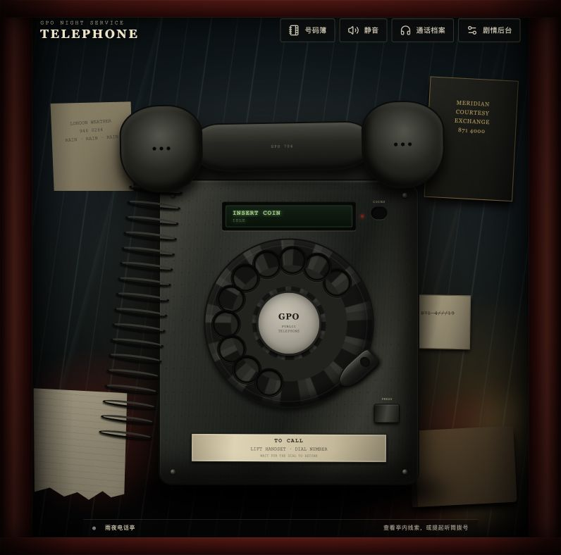
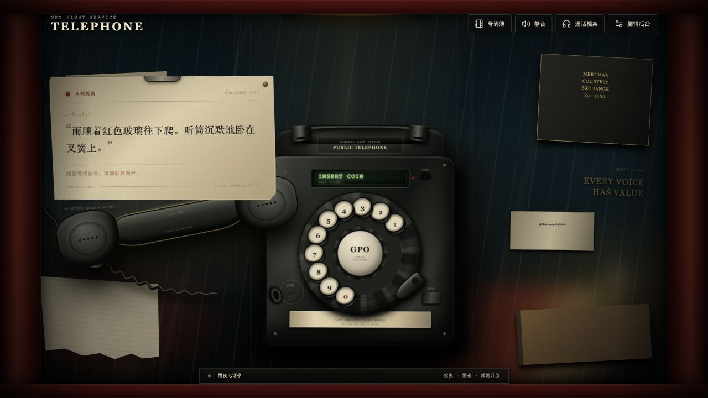
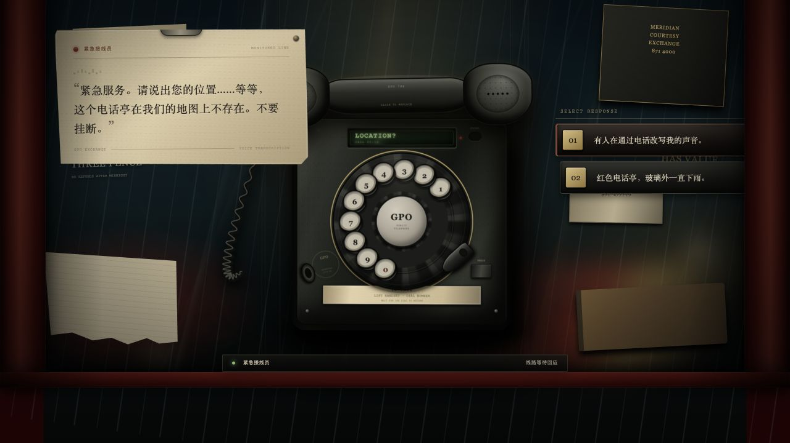
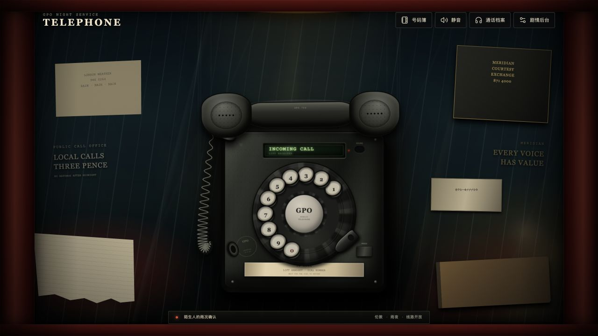
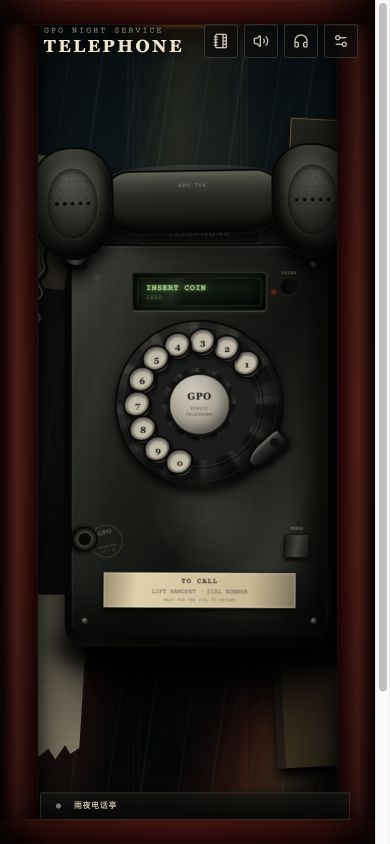

# Telephone 拟物视觉与听筒交互专项验收

验收日期：2026-07-17

验收分支：`codex/telephone-skeuomorphic-polish`

## 目标

在不牺牲现有完整剧情、后台和多周目内容的前提下，修正听筒与电话线的物理表现，并把电话机、转盘、通话文本、回应按钮、灯光和电话亭背景统一为略昏暗的二十世纪拟物风格。

本轮选择 CSS 3D、分层渐变、动态光照和矢量卷线，而未引入 Three.js。固定正视角电话机不需要额外 3D 运行时即可形成足够的体积、反射和材质层次，这也保留了 Pointer Events 转盘与剧情热点的稳定命中区域。

## 完成项

- [x] 听筒改为点击一次拿起，随后无须按住即可跟随鼠标或触控指针。
- [x] 听筒移动受电话线长度约束，位置、倾角、阴影和景深同步变化。
- [x] 听筒离开挂架后再次靠近会进入吸附姿态；再次点击、点击非交互区域或键盘确认可放回。
- [x] 电话线由固定装饰圈改为 SVG 动态卷线，实时连接机身出线口与听筒接头；拉远时线圈自然展开。
- [x] 转盘孔位显示 1–0 号码，并在回弹时保持数字朝向和象牙色嵌件质感。
- [x] 电话机增加胶木高光、壳体厚度、挂架、检修章、铆钉、磨损、玻璃 LCD 和机械层级。
- [x] 通话文本改为被夹住的监听记录纸，加入线路灯、语音电平、纸纤维与交换局印记。
- [x] 回应选项改为交换台机械按键组，包含编号键、金属铆钉、凹陷和年代化字体。
- [x] 电话亭增加玻璃分格、凝水、雨线、顶灯光锥、街灯散景和随指针轻微移动的局部照明。
- [x] 桌面与 390 × 844 窄屏均无横向溢出，核心电话和交互区域保持可用。
- [x] 新增听筒吸附、离架阈值和线长约束的纯模型自动化测试。

## 分阶段截图

### 01 · 修改前基线



### 02 · 听筒跟随与动态电话线



### 03 · 通话纸条与机械回应键



### 04 · 最终桌面总览



### 05 · 390 × 844 窄屏



## 实机交互结果

- 点击拿起后，DOM 状态进入 `is-lifted is-carrying`，指针移动产生实时三维位移和电话线端点更新。
- 离开挂架再回到阈值内，DOM 状态进入 `is-near-cradle`；再次点击后回到 `is-docked`。
- 键盘连续拨入 `999`，LCD 经 `CONNECTING` 进入 `LOCATION?`，出现“紧急接线员”监听纸条和两枚回应键。
- 390 × 844 下文档宽度等于视口宽度，不存在水平滚动。
- 浏览器控制台没有 error 或 warning。

## 质量门

最终以以下命令为准：

```text
npm test       7 files / 26 tests passed
npm run lint   passed with zero warnings
npm run build  TypeScript + Vite production build passed
git diff --check passed
```
