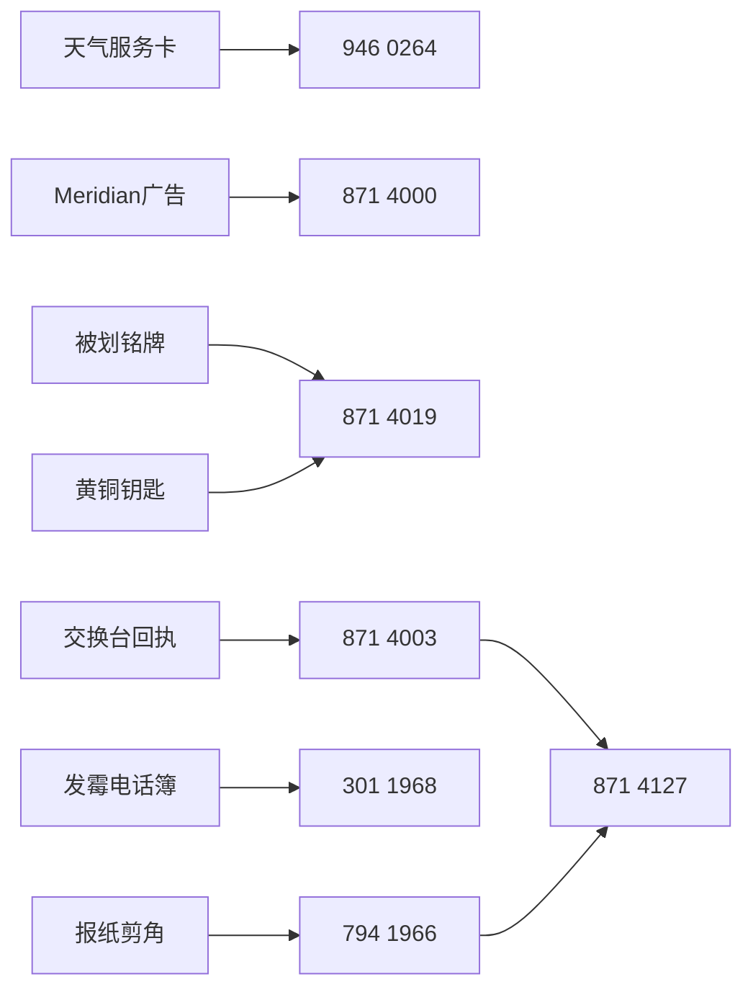

# 电话亭物件与线索

## 当前出现规则

远端恢复版的六个墙面热点和四个柜台物件每次进入场景都会出现。它们不是概率奖励，也不会被三十三件Seedline扩写道具替换。

## 六个墙面热点

| 物件 | 表面信息 | 指向 | 暗线 |
| --- | --- | --- | --- |
| 天气服务卡 | 雨气泡软的公共服务卡 | `946 0264` | 铅笔字说“它从不预报，只提问” |
| Meridian广告 | 免费改善说话方式 | `871 4000` | 模特的笑容像从未挂断过电话 |
| 被划铭牌 | 被故意划掉的维修转接号 | `871 4019` | 有人想抹掉十九号，却没有彻底销毁 |
| 报纸剪角 | Radio Nocturne午夜节目表 | `794 1966` | 旁注要求“听数字，不要听歌” |
| 发霉电话簿 | 失物招领被红笔圈了三遍 | `301 1968` | 认领单姓名栏空白 |
| 退币槽 | 没有硬币，只有一张纸条 | 无号码 | 纸条劝玩家用Meridian的声音撒谎，并提醒第一次失败不是浪费 |

## 四个柜台物件

| 物件 | 可见信息 | 关联 |
| --- | --- | --- |
| 末班车票 | 15路末班车票；背面警告电话响两次时不要报姓名 | [[wiki/010.deployed-canon-ledger|主动来电]]与身份保护 |
| Meridian火柴盒 | 只剩一根火柴；公司旧地址被墨水涂黑 | Meridian机构与被抹除的现实地点 |
| 黄铜钥匙 | 挂着19号牌；齿槽里有电话线胶皮碎屑 | 十九号席位、[[wiki/020.phone-directory|871 4019]]与MCE-0 |
| 交换台回执 | 接线员姓名被水浸开；警告不要相信第三次转接 | 投诉线路与[[wiki/040.call-flow|永远转接]] |

## 物件如何成为关系

## `[网页未实装]` 物件

医院交换便笺、Peter回访卡、创始人原声卡、安全签名穿孔卡、地方诊所卡、Ashdown剪报等属于Seedline扩写材料。它们会在幕后档案中保留设计说明，但不会列入“当前电话亭现存物件”，也不会进入默认关系图。
