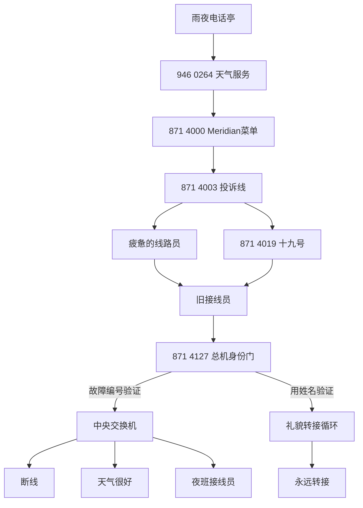

# 通话、分支与七结局

## 主干

`301 1968`提供公用电话钥匙与身份旁证，`794 1966`提前说出中央号码。它们不是通关时必须按固定顺序拨打的“第四章”和“第五章”，而是帮助玩家理解身份门、隐藏条件与号码关系的旁支。

## 七个活动结局

| 结局 | 当前主要触发 | 当前结果 |
| --- | --- | --- |
| 断线 | 取得旧接线员代码后，在中央交换机切断训练线 | 城市安静四秒，许多人重新听见自己的声音 |
| 入职 | 完成顺从训练或向代表申请处提交原身份 | 玩家没有挂断，而是被转到线路另一端 |
| 永远转接 | 未经授权进入总机、错误验证或继续等待 | 系统永远寻找不存在的接线员 |
| 号码磨损 | 多次错误拨号并反复挂断，或累计过多错号 | 数字消失，电话只记得玩家拨错过 |
| 天气很好 | 天气服务沉默超时，或在总机误切天气线 | 窗外仍在下雨，玩家的回答却换了季节 |
| 假代表 | 已见过“入职”后，在代表申请处伪造身份 | 玩家学会公司声音，但没有交出自己的身份 |
| 夜班接线员 | 已见“断线”和“入职”、发现Radio Nocturne后接管总机 | 此后被选中的陌生人会先听见玩家的警告 |

“假代表”和“夜班接线员”明确使用历史游玩条件，所以第一次进入游戏不一定能取得全部结局。

## 旁支如何改变理解

- `999`证明电话亭不在紧急服务地图上，也能把求助转成线路投诉；
- 陌生雨况来电让玩家决定帮助另一个接听者，还是把他送回天气校准；
- Meridian主动服务可以直接进入菜单，也可以因拒绝而进入投诉；
- 疲惫推销员知道十九号，但玩家仍要决定是否相信他；
- 失物招领把“身份”处理成可以被保管、转交和重新分配的东西；
- Radio Nocturne提供数字，却不提供进入总机的权力。

## `[网页未实装]` 六章流程

网页小说把活动号码扩展成Maeve医院转运、Peter员工压力、Leonard工程证据、Dorothy外部托管、Wren版本治理和Seedline历史。这些人物动机与六夜结构目前没有写入活动JSON，阅读时应把它们视为长篇扩写，而不是隐藏的当前关卡说明。
