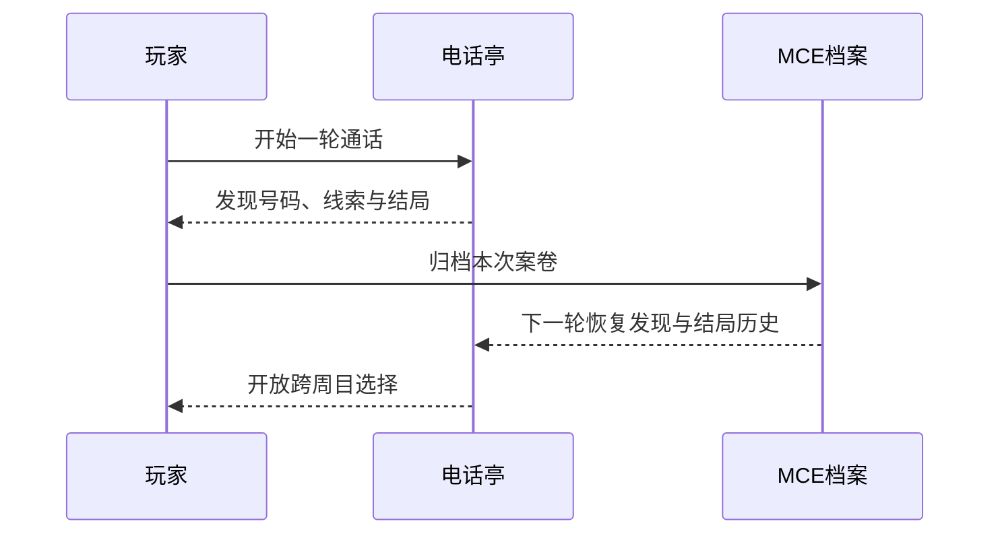

# 通话档案与重新开始

## 游戏实际保留什么

每次抵达结局，游戏把本次通话保存为一份MCE案卷。之后重新进入时，会继续保留下列玩家进度：

- 已发现的号码；
- 已取得的线索；
- 已见结局；
- 已完成夜班次数；
- 上一次结局；
- 规则数据明确写入的长期事实与状态。

当前远端恢复故事使用独立的 `telephone.meridian-remote` 档案命名，不会把旧Seedline测试进度导入当前游戏。

## 为什么有些结局需要第二次游玩

“假代表”要求档案里已经有“入职”，因为玩家只有先亲身听完代表训练，下一次才有足够经验模仿公司的声音。

“夜班接线员”要求已经见过“断线”和“入职”，并发现Radio Nocturne。它不是一条第一次误打误撞就能开启的万能好结局，而是玩家看过服从与破坏两端后，对中央总机作出的第三种选择。

## 人物是否真的记得

活动JSON明确实现的是玩家档案、号码、线索和结局条件的延续；它没有逐一写出每名来电者在下一夜如何复述上一轮经历。因此公开 Wiki 不把“所有人物明确记得前夜”伪装成已经在当前网页演出的事实。

`[网页未实装]` 的六章扩写给出了一种完整解释：每次重新开始是更晚的复核夜班，不是时间倒流；Vale依靠MCE-0交班记录重新取得工作记忆，其他独立人物则因为现实时间继续而自然记得先前发生的事。这个解释与活动档案机制相容，但目前仍是幕后叙事设定。

## 阅读顺序

相关页面：[[wiki/020.phone-directory|活动电话簿]]、[[wiki/040.call-flow|七结局]]。
